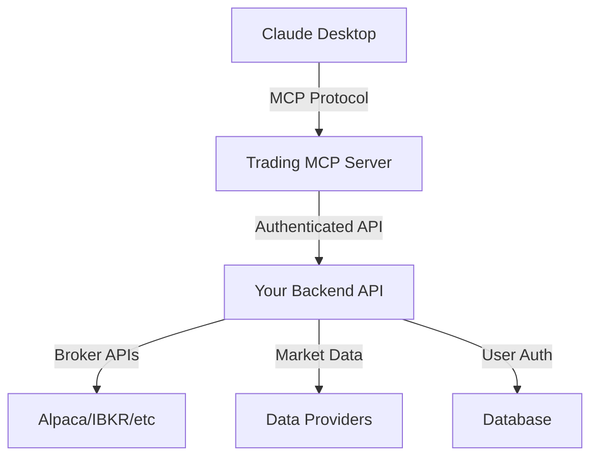

# Trading MCP Tool Architecture

## Vision: Claude Desktop as Personal Quant

Transform Claude Desktop into a sophisticated trading assistant that can:
- Execute trades through user's broker accounts
- Run backtests on strategies
- Analyze market data in real-time
- Make quantitative decisions
- Generate trading signals

## Architecture Overview

### 1. **MCP Server Package**
```
trading-mcp-server/
├── package.json
├── src/
│   ├── index.ts          # Main MCP server
│   ├── tools/
│   │   ├── market-data.ts
│   │   ├── backtesting.ts
│   │   ├── trading.ts
│   │   ├── analysis.ts
│   │   └── portfolio.ts
│   ├── auth/
│   │   └── api-manager.ts
│   └── config/
│       └── user-config.ts
└── README.md
```

### 2. **User Flow**

1. **Sign Up on Website**
   - User creates account at your-trading-platform.com
   - Receives unique API key
   - Downloads MCP configuration

2. **Install in Claude Desktop**
   - User adds MCP server to Claude Desktop config
   - Enters their API key
   - Claude gains trading capabilities

3. **Available Tools in Claude**
   ```typescript
   // Market Data Tools
   - get_stock_price
   - get_market_data
   - get_options_chain
   - get_crypto_prices
   
   // Trading Tools
   - place_order
   - cancel_order
   - get_positions
   - get_account_balance
   
   // Backtesting Tools
   - run_backtest
   - analyze_strategy
   - optimize_parameters
   - generate_report
   
   // Analysis Tools
   - calculate_indicators
   - find_patterns
   - screen_stocks
   - risk_analysis
   ```

### 3. **Security Architecture**



## Implementation Plan

### Phase 1: Core MCP Server
Basic trading functionality with paper trading

### Phase 2: Advanced Features
- Multi-broker support
- Real-time streaming
- Advanced strategies

### Phase 3: AI Integration
- ML-based predictions
- Natural language strategies
- Automated optimization

## Security Considerations

1. **API Key Management**
   - Unique keys per user
   - Rate limiting
   - Permission scopes

2. **Trade Safety**
   - Position size limits
   - Daily loss limits
   - Approval workflows

3. **Data Privacy**
   - End-to-end encryption
   - No strategy sharing
   - Audit logging
