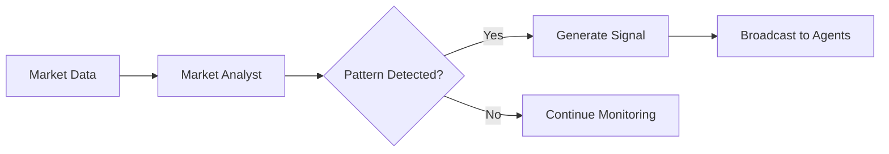
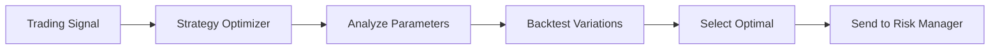
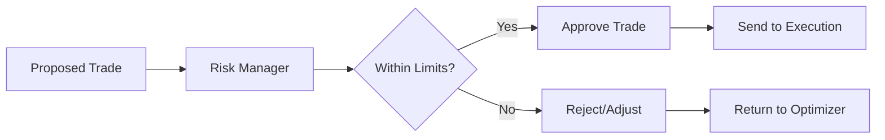
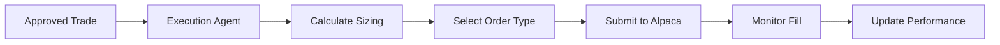

# AI Agents Architecture

## Overview

ULTRA Trading Platform implements a sophisticated multi-agent AI system designed to operate as an autonomous quant hedge fund trading desk. Each agent specializes in specific aspects of trading, collaborating through Cloudflare Durable Objects for real-time decision making.

## Agent Architecture

### Core Agents

#### 1. Market Analyst Agent (Powered by Google Gemini 2.0 Flash)
**Purpose**: Real-time market analysis and pattern recognition

**Responsibilities**:
- Analyze market microstructure and order flow
- Identify trading patterns and opportunities
- Monitor news sentiment and market events
- Generate market condition reports
- Detect regime changes and volatility shifts

**Implementation**:
```typescript
// src/agents/MarketAnalystAgent.ts
export class MarketAnalystAgent extends BaseAgent {
  model = '@cf/google/gemini-2.0-flash';
  
  async analyzeMarket(data: MarketData): Promise<MarketAnalysis> {
    // Real-time pattern recognition
    // Volatility analysis
    // Trend identification
  }
}
```

#### 2. Strategy Optimizer Agent (Powered by Claude 4 Opus)
**Purpose**: Strategy optimization and parameter tuning

**Responsibilities**:
- Optimize strategy parameters based on market conditions
- Backtest strategy variations
- Risk-reward analysis
- Portfolio allocation decisions
- Strategy performance evaluation

**Implementation**:
```typescript
// src/agents/StrategyOptimizerAgent.ts
export class StrategyOptimizerAgent extends BaseAgent {
  model = 'claude-4-opus';
  
  async optimizeStrategy(
    strategy: TradingStrategy,
    marketConditions: MarketConditions
  ): Promise<OptimizedStrategy> {
    // Parameter optimization
    // Risk assessment
    // Performance projection
  }
}
```

#### 3. Execution Agent
**Purpose**: Smart order routing and position management

**Responsibilities**:
- Order execution optimization
- Slippage minimization
- Position sizing
- Entry/exit timing
- Order type selection

**Implementation**:
```typescript
// src/agents/ExecutionAgent.ts
export class ExecutionAgent extends BaseAgent {
  async executeSignal(
    signal: TradingSignal,
    account: Account
  ): Promise<ExecutionResult> {
    // Smart order routing
    // Position management
    // Fill optimization
  }
}
```

#### 4. Risk Manager Agent
**Purpose**: Portfolio risk monitoring and control

**Responsibilities**:
- Position risk assessment
- Portfolio VaR calculation
- Stop-loss enforcement
- Correlation monitoring
- Drawdown protection

**Implementation**:
```typescript
// src/agents/RiskManagerAgent.ts
export class RiskManagerAgent extends BaseAgent {
  async assessRisk(
    portfolio: Portfolio,
    proposedTrade: Trade
  ): Promise<RiskAssessment> {
    // Risk metrics calculation
    // Limit checking
    // Approval/rejection logic
  }
}
```

#### 5. Performance Analyst Agent
**Purpose**: P&L tracking and daily target management

**Responsibilities**:
- Real-time P&L calculation
- Daily profit target monitoring ($300/day)
- Performance attribution
- Trading metrics analysis
- Automatic trading stops

**Implementation**:
```typescript
// src/agents/PerformanceAgent.ts
export class PerformanceAgent extends BaseAgent {
  private dailyTarget = 300; // USD
  
  async checkDailyPerformance(): Promise<PerformanceStatus> {
    // Calculate daily P&L
    // Check against target
    // Trigger stop if target reached
  }
}
```

## Agent Communication System

### Durable Objects Integration

Agents communicate through Cloudflare Durable Objects for stateful coordination:

```typescript
// src/durable-objects/AgentCoordinator.ts
export class AgentCoordinator extends DurableObject {
  private agents: Map<string, AgentState> = new Map();
  private decisions: DecisionQueue = new DecisionQueue();
  
  async coordinateDecision(
    context: TradingContext
  ): Promise<TradingDecision> {
    // Gather inputs from all agents
    // Resolve conflicts
    // Return consensus decision
  }
}
```

### Communication Protocol

```typescript
interface AgentMessage {
  id: string;
  from: AgentType;
  to: AgentType | 'broadcast';
  type: MessageType;
  payload: any;
  timestamp: number;
  priority: Priority;
}

enum MessageType {
  MARKET_UPDATE = 'MARKET_UPDATE',
  SIGNAL_GENERATED = 'SIGNAL_GENERATED',
  RISK_ALERT = 'RISK_ALERT',
  EXECUTION_REQUEST = 'EXECUTION_REQUEST',
  PERFORMANCE_UPDATE = 'PERFORMANCE_UPDATE'
}
```

## Decision Flow

### 1. Market Analysis Phase


### 2. Strategy Optimization Phase


### 3. Risk Assessment Phase


### 4. Execution Phase


## AI Model Configuration

### Gemini 2.0 Flash Configuration
```typescript
const geminiConfig = {
  model: '@cf/google/gemini-2.0-flash',
  temperature: 0.3, // Lower for consistent analysis
  maxTokens: 4096,
  systemPrompt: `You are a professional market analyst AI...`
};
```

### Claude 4 Opus Configuration
```typescript
const claudeConfig = {
  model: 'claude-4-opus',
  temperature: 0.2, // Very low for strategy optimization
  maxTokens: 8192,
  systemPrompt: `You are a quantitative strategy optimizer...`
};
```

## Performance Optimization

### Edge Computing Benefits
- Sub-10ms agent response times
- Global deployment across 275+ cities
- Zero cold starts with Durable Objects
- Automatic scaling based on load

### Caching Strategy
```typescript
// Agent decision caching
const decisionCache = {
  marketConditions: 60, // 1 minute TTL
  strategyParams: 300, // 5 minute TTL
  riskMetrics: 30, // 30 second TTL
};
```

## Monitoring and Observability

### Agent Metrics
- Response time per agent
- Decision accuracy tracking
- Resource utilization
- Error rates and recovery

### Dashboard Integration
```typescript
// Real-time agent status WebSocket updates
{
  type: 'AGENT_STATUS',
  agents: {
    marketAnalyst: { status: 'active', lastDecision: '...', latency: 8 },
    strategyOptimizer: { status: 'active', lastDecision: '...', latency: 12 },
    // ... other agents
  }
}
```

## Security Considerations

### Agent Isolation
- Each agent runs in isolated context
- No direct access to trading credentials
- All actions logged and auditable

### Decision Validation
- Multi-agent consensus for high-value trades
- Human override capability
- Automatic circuit breakers

## Future Enhancements

### Planned Features
1. **Ensemble Learning**: Multiple AI models per agent
2. **Reinforcement Learning**: Self-improving strategies
3. **Market Maker Agent**: Liquidity provision
4. **Sentiment Analyst**: Social media analysis
5. **Macro Analyst**: Economic indicator integration

### Research Areas
- Quantum-inspired optimization
- Federated learning across agents
- Advanced portfolio theory implementation
- High-frequency trading capabilities