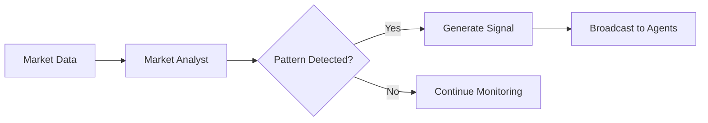
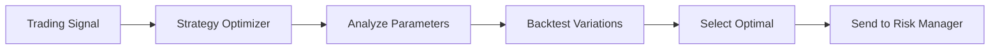
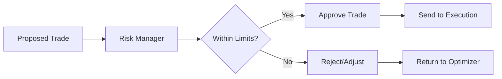
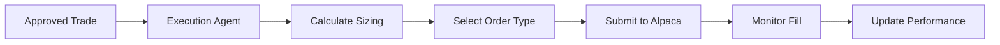

# AI Agents Architecture

## Overview

ULTRA Trading Platform implements a sophisticated multi-agent AI system designed to operate as an autonomous quant hedge fund trading desk. Each agent specializes in specific aspects of trading, collaborating through Cloudflare Durable Objects for real-time decision making.

## AI Integration Strategy

ULTRA uses a hybrid approach combining Cloudflare Workers AI with external AI APIs to leverage the best of both worlds:

### Cloudflare Workers AI
- **Low-latency inference**: Sub-10ms response times at the edge
- **Cost-effective**: No per-request charges for basic models
- **Used for**: Risk analysis, performance tracking, and real-time decision making

### External AI APIs
- **Advanced capabilities**: Access to state-of-the-art models
- **Specialized reasoning**: Complex strategy optimization and market analysis
- **Used for**: Market analysis (Google Gemini) and strategy optimization (Anthropic Claude)

### API Key Management
All external API keys are securely managed via Cloudflare Workers secrets:
```bash
wrangler secret put ANTHROPIC_API_KEY
wrangler secret put GOOGLE_API_KEY
wrangler secret put ALPACA_KEY_ID
wrangler secret put ALPACA_SECRET_KEY
```

## Agent Architecture

### Core Agents

#### 1. Market Analyst Agent (Powered by Google Gemini API)
**Purpose**: Real-time market analysis and pattern recognition

**Responsibilities**:
- Analyze market microstructure and order flow
- Identify trading patterns and opportunities
- Monitor news sentiment and market events
- Generate market condition reports
- Detect regime changes and volatility shifts

**Implementation**:
```typescript
// src/agents/MarketAnalystAgent.ts
export class MarketAnalystAgent extends BaseAgent {
  model = 'gemini-pro'; // Using Google Gemini API directly
  
  async analyzeMarket(data: MarketData): Promise<MarketAnalysis> {
    // Uses Google Gemini API for advanced market analysis
    // Real-time pattern recognition
    // Volatility analysis
    // Trend identification
  }
}
```

**Note**: Currently uses Cloudflare Workers AI binding, but can be switched to Google Gemini API for enhanced capabilities.

#### 2. Strategy Optimizer Agent (Powered by Anthropic Claude API)
**Purpose**: Strategy optimization and parameter tuning

**Responsibilities**:
- Optimize strategy parameters based on market conditions
- Backtest strategy variations
- Risk-reward analysis
- Portfolio allocation decisions
- Strategy performance evaluation

**Implementation**:
```typescript
// src/agents/StrategyOptimizerAgent.ts
export class StrategyOptimizerAgent extends BaseAgent {
  model = 'claude-3-opus-20240229'; // Using Anthropic API directly
  
  async optimizeStrategy(
    strategy: TradingStrategy,
    marketConditions: MarketConditions
  ): Promise<OptimizedStrategy> {
    // Uses Anthropic Claude for advanced strategy optimization
    // Parameter optimization with reasoning
    // Risk assessment
    // Performance projection
  }
}
```

**Note**: Uses Anthropic's Claude API for complex reasoning and optimization tasks.

#### 3. Execution Agent
**Purpose**: Smart order routing and position management

**Responsibilities**:
- Order execution optimization
- Slippage minimization
- Position sizing
- Entry/exit timing
- Order type selection

**Implementation**:
```typescript
// src/agents/ExecutionAgent.ts
export class ExecutionAgent extends BaseAgent {
  async executeSignal(
    signal: TradingSignal,
    account: Account
  ): Promise<ExecutionResult> {
    // Smart order routing
    // Position management
    // Fill optimization
  }
}
```

#### 4. Risk Manager Agent (Powered by Cloudflare Workers AI)
**Purpose**: Portfolio risk monitoring and control

**Responsibilities**:
- Position risk assessment
- Portfolio VaR calculation
- Stop-loss enforcement
- Correlation monitoring
- Drawdown protection

**Implementation**:
```typescript
// src/agents/RiskManagerAgent.ts
export class RiskManagerAgent extends BaseAgent {
  model = '@cf/meta/llama-3.1-8b-instruct'; // Using Cloudflare Workers AI
  
  async assessRisk(
    portfolio: Portfolio,
    proposedTrade: Trade
  ): Promise<RiskAssessment> {
    // Uses Llama 3.1 for fast risk assessment
    // Risk metrics calculation
    // Limit checking
    // Approval/rejection logic
  }
}
```

**Note**: Uses Cloudflare Workers AI for low-latency risk calculations at the edge.

#### 5. Performance Analyst Agent (Powered by Cloudflare Workers AI)
**Purpose**: P&L tracking and daily target management

**Responsibilities**:
- Real-time P&L calculation
- Daily profit target monitoring ($300/day)
- Performance attribution
- Trading metrics analysis
- Automatic trading stops

**Implementation**:
```typescript
// src/agents/PerformanceAnalystAgent.ts
export class PerformanceAnalystAgent extends BaseAgent {
  model = '@cf/meta/llama-3.1-8b-instruct'; // Using Cloudflare Workers AI
  private dailyTarget = 300; // USD
  
  async checkDailyPerformance(): Promise<PerformanceStatus> {
    // Uses Llama 3.1 for performance insights
    // Calculate daily P&L
    // Check against target
    // Trigger stop if target reached
  }
}
```

**Note**: Uses Cloudflare Workers AI for real-time performance tracking with minimal latency.

## Agent Communication System

### Durable Objects Integration

Agents communicate through Cloudflare Durable Objects for stateful coordination:

```typescript
// src/durable-objects/AgentCoordinator.ts
export class AgentCoordinator extends DurableObject {
  private agents: Map<string, AgentState> = new Map();
  private decisions: DecisionQueue = new DecisionQueue();
  
  async coordinateDecision(
    context: TradingContext
  ): Promise<TradingDecision> {
    // Gather inputs from all agents
    // Resolve conflicts
    // Return consensus decision
  }
}
```

### Communication Protocol

```typescript
interface AgentMessage {
  id: string;
  from: AgentType;
  to: AgentType | 'broadcast';
  type: MessageType;
  payload: any;
  timestamp: number;
  priority: Priority;
}

enum MessageType {
  MARKET_UPDATE = 'MARKET_UPDATE',
  SIGNAL_GENERATED = 'SIGNAL_GENERATED',
  RISK_ALERT = 'RISK_ALERT',
  EXECUTION_REQUEST = 'EXECUTION_REQUEST',
  PERFORMANCE_UPDATE = 'PERFORMANCE_UPDATE'
}
```

## Decision Flow

### 1. Market Analysis Phase


### 2. Strategy Optimization Phase


### 3. Risk Assessment Phase


### 4. Execution Phase


## AI Model Configuration

### Google Gemini API Configuration
```typescript
const geminiConfig = {
  model: 'gemini-pro',
  temperature: 0.3, // Lower for consistent analysis
  maxTokens: 4096,
  apiKey: env.GOOGLE_API_KEY,
  systemPrompt: `You are a professional market analyst AI...`
};
```

### Anthropic Claude API Configuration
```typescript
const claudeConfig = {
  model: 'claude-3-opus-20240229',
  temperature: 0.2, // Very low for strategy optimization
  maxTokens: 8192,
  apiKey: env.ANTHROPIC_API_KEY,
  systemPrompt: `You are a quantitative strategy optimizer...`
};
```

### Cloudflare Workers AI Configuration
```typescript
const workersAIConfig = {
  models: {
    riskAnalysis: '@cf/meta/llama-3.1-8b-instruct',
    performance: '@cf/meta/llama-3.1-8b-instruct',
    embeddings: '@cf/baai/bge-base-en-v1.5'
  },
  binding: env.AI // Cloudflare AI binding
};
```

## Performance Optimization

### Edge Computing Benefits
- Sub-10ms agent response times
- Global deployment across 275+ cities
- Zero cold starts with Durable Objects
- Automatic scaling based on load

### Caching Strategy
```typescript
// Agent decision caching
const decisionCache = {
  marketConditions: 60, // 1 minute TTL
  strategyParams: 300, // 5 minute TTL
  riskMetrics: 30, // 30 second TTL
};
```

## Monitoring and Observability

### Agent Metrics
- Response time per agent
- Decision accuracy tracking
- Resource utilization
- Error rates and recovery

### Dashboard Integration
```typescript
// Real-time agent status WebSocket updates
{
  type: 'AGENT_STATUS',
  agents: {
    marketAnalyst: { status: 'active', lastDecision: '...', latency: 8 },
    strategyOptimizer: { status: 'active', lastDecision: '...', latency: 12 },
    // ... other agents
  }
}
```

## Security Considerations

### Agent Isolation
- Each agent runs in isolated context
- No direct access to trading credentials
- All actions logged and auditable

### Decision Validation
- Multi-agent consensus for high-value trades
- Human override capability
- Automatic circuit breakers

## Future Enhancements

### Planned Features
1. **Ensemble Learning**: Multiple AI models per agent
2. **Reinforcement Learning**: Self-improving strategies
3. **Market Maker Agent**: Liquidity provision
4. **Sentiment Analyst**: Social media analysis
5. **Macro Analyst**: Economic indicator integration

### Research Areas
- Quantum-inspired optimization
- Federated learning across agents
- Advanced portfolio theory implementation
- High-frequency trading capabilities

## Current Implementation Status

### ✅ Completed
- Base Agent Architecture (`BaseAgent.ts`, `AIAgent.ts`)
- Agent Type System (`types/agents.ts`)
- Market Analyst Agent (Google Gemini API / Cloudflare AI)
- Strategy Optimizer Agent (Anthropic Claude API)
- Risk Manager Agent (Cloudflare Workers AI - Llama 3.1)
- Performance Analyst Agent (Cloudflare Workers AI - Llama 3.1)
- Execution Agent (Smart order routing)
- Agent Coordinator (Durable Objects)

### 🚧 In Progress
- Automated Trading Pipeline
- Daily Profit Target System ($300/day)
- WebSocket Real-time Updates

### 📋 Next Steps
- Cron Triggers for Scheduled Tasks
- Real-time Monitoring Dashboard
- Comprehensive Testing Suite