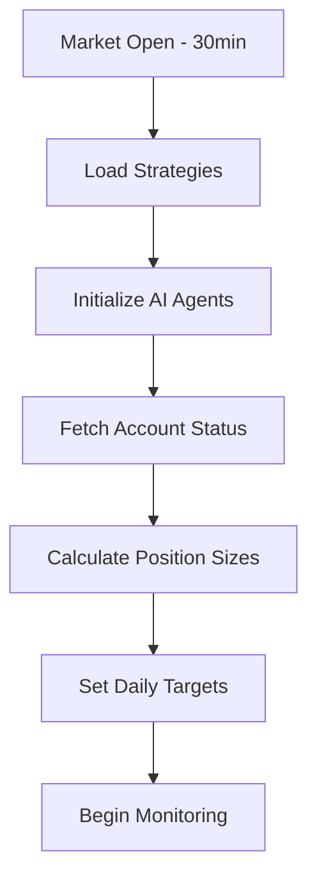
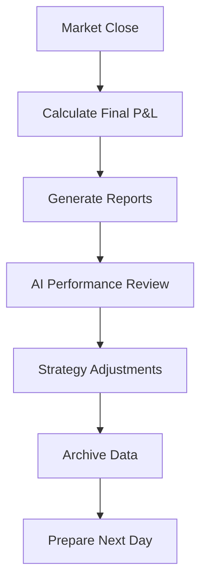

# Automated Trading System

## Overview

The ULTRA Trading Platform's automated trading system leverages AI agents to create a fully autonomous trading desk that operates 24/7 with minimal human intervention. The system is designed to achieve consistent daily profit targets while managing risk across multiple strategies.

## Core Components

### 1. Trading Engine

The automated trading engine orchestrates all trading activities:

```typescript
// src/engine/AutomatedTradingEngine.ts
export class AutomatedTradingEngine {
  private agents: AgentPool;
  private strategies: StrategyManager;
  private riskManager: RiskManager;
  private performanceTracker: PerformanceTracker;
  
  async start(): Promise<void> {
    // Initialize all components
    // Start market monitoring
    // Begin trading loop
  }
  
  async executeTradingCycle(): Promise<void> {
    // 1. Market analysis
    // 2. Signal generation
    // 3. Risk assessment
    // 4. Order execution
    // 5. Performance tracking
  }
}
```

### 2. Strategy Management

Multiple strategies run concurrently with AI optimization:

```typescript
interface AutomatedStrategy {
  id: string;
  name: string;
  enabled: boolean;
  allocation: number; // Percentage of capital
  aiAgent: AgentType;
  parameters: StrategyParameters;
  performance: StrategyPerformance;
}
```

## Trading Workflow

### 1. Pre-Market Preparation


### 2. Intraday Trading Loop
```typescript
// Runs every 1 minute during market hours
async function tradingLoop() {
  while (marketIsOpen() && !dailyTargetReached()) {
    // Step 1: Gather market data
    const marketData = await gatherMarketData();
    
    // Step 2: AI analysis
    const analysis = await runAIAnalysis(marketData);
    
    // Step 3: Generate signals
    const signals = await generateTradingSignals(analysis);
    
    // Step 4: Risk validation
    const validatedSignals = await validateRisk(signals);
    
    // Step 5: Execute trades
    const executions = await executeTrades(validatedSignals);
    
    // Step 6: Update performance
    await updatePerformance(executions);
    
    // Step 7: Check daily target
    if (await checkDailyTarget()) {
      await stopTrading();
      break;
    }
  }
}
```

### 3. Post-Market Analysis


## Daily Profit Target System

### Configuration
```typescript
const profitTargetConfig = {
  dailyTarget: 300, // USD
  maxDailyLoss: 150, // USD
  targetBuffer: 0.95, // Stop at 95% of target
  riskReduction: {
    at80Percent: 0.5, // Reduce position size by 50%
    at90Percent: 0.25, // Reduce position size by 75%
  }
};
```

### Implementation
```typescript
export class DailyTargetManager {
  private startingBalance: number;
  private currentPnL: number = 0;
  private tradesExecuted: number = 0;
  
  async checkTarget(): Promise<TargetStatus> {
    const pnlPercent = this.currentPnL / this.dailyTarget;
    
    if (this.currentPnL >= this.dailyTarget) {
      return {
        status: 'TARGET_REACHED',
        action: 'STOP_TRADING',
        message: `Daily target of $${this.dailyTarget} reached!`
      };
    }
    
    if (this.currentPnL <= -this.maxDailyLoss) {
      return {
        status: 'MAX_LOSS_REACHED',
        action: 'STOP_TRADING',
        message: 'Maximum daily loss reached. Trading stopped.'
      };
    }
    
    if (pnlPercent >= 0.8) {
      return {
        status: 'APPROACHING_TARGET',
        action: 'REDUCE_RISK',
        riskMultiplier: pnlPercent >= 0.9 ? 0.25 : 0.5
      };
    }
    
    return {
      status: 'NORMAL',
      action: 'CONTINUE',
      remaining: this.dailyTarget - this.currentPnL
    };
  }
}
```

## Strategy Automation

### 1. Gamma Scalping Automation
```typescript
const gammaScalpingAutomation = {
  schedule: '*/5 * * * *', // Every 5 minutes
  workflow: [
    'Calculate current gamma exposure',
    'Identify hedge requirements',
    'Generate rebalancing orders',
    'Execute with smart routing',
    'Update hedge records'
  ],
  aiOptimization: {
    volatilityPrediction: 'Gemini',
    hedgeRatioOptimization: 'Claude',
    executionTiming: 'ML Model'
  }
};
```

### 2. Iron Condor Automation
```typescript
const ironCondorAutomation = {
  entrySchedule: '0 10 * * 1-5', // 10 AM weekdays
  monitoringSchedule: '*/15 * * * *', // Every 15 minutes
  workflow: [
    'Scan for range-bound markets',
    'Calculate optimal strikes',
    'Check liquidity and spreads',
    'Place four-leg orders',
    'Monitor for adjustments'
  ],
  adjustmentRules: {
    breachThreshold: 0.7, // 70% of short strike
    profitTarget: 0.4, // 40% of max profit
    daysToExpiry: 7 // Close if < 7 days
  }
};
```

### 3. Wheel Strategy Automation
```typescript
const wheelStrategyAutomation = {
  putSchedule: '0 9:35 * * 1', // Monday open
  callSchedule: 'ON_ASSIGNMENT',
  workflow: {
    cashSecuredPuts: [
      'Identify high-IV stocks',
      'Calculate optimal strikes',
      'Ensure cash coverage',
      'Place CSP orders'
    ],
    coveredCalls: [
      'Check assigned shares',
      'Calculate call strikes',
      'Place covered call orders',
      'Track until expiry'
    ]
  }
};
```

## Risk Management

### Position Sizing
```typescript
export class AutomatedPositionSizer {
  async calculatePositionSize(
    signal: TradingSignal,
    account: Account,
    riskProfile: RiskProfile
  ): Promise<number> {
    const kellyCriterion = this.calculateKelly(signal);
    const maxRisk = account.balance * riskProfile.maxPositionRisk;
    const volatilityAdjusted = this.adjustForVolatility(signal);
    
    return Math.min(
      kellyCriterion,
      maxRisk,
      volatilityAdjusted,
      account.buyingPower * 0.25 // Never use more than 25%
    );
  }
}
```

### Stop Loss Management
```typescript
const stopLossRules = {
  initial: {
    percentage: 0.02, // 2% stop loss
    atr: 1.5, // 1.5x ATR
    support: true // Use technical levels
  },
  trailing: {
    activation: 0.01, // Activate at 1% profit
    distance: 0.005, // Trail by 0.5%
    acceleration: true // Tighten as profit grows
  },
  timeStop: {
    maxHoldingPeriod: '2D', // 2 days max
    decayFunction: 'linear'
  }
};
```

## Monitoring and Alerts

### Real-time Dashboard
```typescript
interface AutomatedTradingDashboard {
  status: TradingStatus;
  dailyPnL: number;
  targetProgress: number;
  activePositions: Position[];
  pendingOrders: Order[];
  agentStatuses: AgentStatus[];
  recentExecutions: Execution[];
  alerts: Alert[];
}
```

### Alert System
```typescript
enum AlertLevel {
  INFO = 'INFO',
  WARNING = 'WARNING',
  CRITICAL = 'CRITICAL'
}

interface TradingAlert {
  level: AlertLevel;
  type: string;
  message: string;
  timestamp: number;
  requiresAction: boolean;
  suggestedAction?: string;
}

// Alert triggers
const alertTriggers = {
  largeLoss: -50, // Alert on $50+ loss
  unusualVolume: 3, // 3x average volume
  connectionIssue: 5000, // 5s timeout
  agentError: true,
  riskBreach: true
};
```

## Performance Analytics

### Daily Report Generation
```typescript
export async function generateDailyReport(): Promise<DailyReport> {
  return {
    date: new Date().toISOString(),
    summary: {
      totalPnL: await calculateDailyPnL(),
      winRate: await calculateWinRate(),
      sharpeRatio: await calculateSharpe(),
      maxDrawdown: await calculateDrawdown()
    },
    strategyBreakdown: await getStrategyPerformance(),
    agentPerformance: await getAgentMetrics(),
    marketConditions: await getMarketSummary(),
    recommendations: await generateAIRecommendations()
  };
}
```

### Performance Metrics
```typescript
interface PerformanceMetrics {
  // Financial metrics
  totalReturn: number;
  annualizedReturn: number;
  volatility: number;
  sharpeRatio: number;
  sortinoRatio: number;
  maxDrawdown: number;
  
  // Trading metrics
  totalTrades: number;
  winningTrades: number;
  losingTrades: number;
  avgWinSize: number;
  avgLossSize: number;
  profitFactor: number;
  
  // AI metrics
  signalAccuracy: number;
  predictionScore: number;
  optimizationImpact: number;
}
```

## Fail-Safe Mechanisms

### Circuit Breakers
```typescript
const circuitBreakers = {
  maxDailyLoss: {
    threshold: 150, // USD
    action: 'HALT_ALL_TRADING'
  },
  maxConsecutiveLosses: {
    threshold: 5,
    action: 'PAUSE_AND_REVIEW'
  },
  abnormalVolatility: {
    threshold: 3, // 3 sigma move
    action: 'REDUCE_EXPOSURE'
  },
  technicalFailure: {
    maxRetries: 3,
    action: 'SAFE_MODE'
  }
};
```

### Recovery Procedures
```typescript
export class TradingRecovery {
  async handleFailure(error: TradingError): Promise<void> {
    // 1. Log error with full context
    await this.logError(error);
    
    // 2. Close risky positions
    await this.closeRiskyPositions();
    
    // 3. Cancel pending orders
    await this.cancelPendingOrders();
    
    // 4. Enter safe mode
    await this.enterSafeMode();
    
    // 5. Notify administrators
    await this.sendAlerts(error);
    
    // 6. Attempt recovery
    await this.attemptRecovery();
  }
}
```

## Configuration Management

### Environment-based Settings
```typescript
// config/automated-trading.ts
export const automatedTradingConfig = {
  development: {
    enabled: false,
    paperTrading: true,
    maxDailyTrades: 10,
    positionSizeLimit: 100
  },
  staging: {
    enabled: true,
    paperTrading: true,
    maxDailyTrades: 50,
    positionSizeLimit: 1000
  },
  production: {
    enabled: true,
    paperTrading: false,
    maxDailyTrades: 100,
    positionSizeLimit: 10000
  }
};
```

## Getting Started

### 1. Enable Automated Trading
```bash
# Set up environment
npm run setup:automated-trading

# Configure strategies
npm run config:strategies

# Start in paper mode
npm run start:auto-trade:paper
```

### 2. Monitor Performance
```bash
# Real-time monitoring
npm run monitor:trading

# View dashboard
open https://ultra-trading.tkipper.workers.dev/dashboard

# Check logs
npm run logs:trading
```

### 3. Adjust Settings
```typescript
// Via API
POST /api/v1/auto/configure
{
  "dailyTarget": 300,
  "maxDailyLoss": 150,
  "strategies": {
    "gammaScalping": { "enabled": true, "allocation": 0.4 },
    "ironCondor": { "enabled": true, "allocation": 0.3 },
    "wheelStrategy": { "enabled": true, "allocation": 0.3 }
  }
}
```

## Best Practices

1. **Start Small**: Begin with paper trading and small position sizes
2. **Monitor Actively**: Watch the system closely for the first few weeks
3. **Regular Reviews**: Analyze performance weekly and adjust parameters
4. **Risk First**: Always prioritize risk management over profits
5. **Gradual Scaling**: Increase position sizes gradually as confidence grows

## Future Enhancements

- Machine learning model training on historical data
- Multi-asset class support (crypto, forex)
- Advanced portfolio optimization
- Social sentiment integration
- Regulatory compliance automation